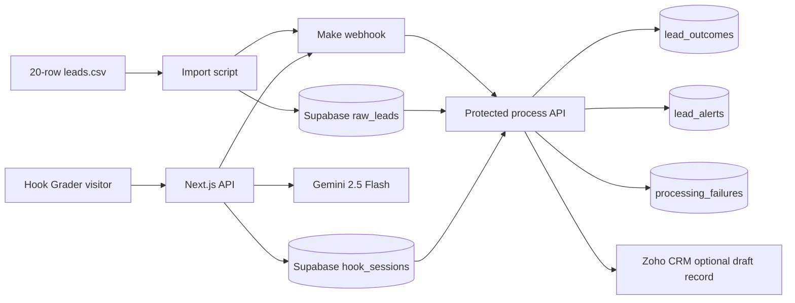

# Myntmore Round 2 - Lead Follow-Up Engine and LinkedIn Hook Grader

**Candidate:** Ketan Tiwari (confirm spelling and email before submission)  
**Status:** Complete codebase with an offline mocked end-to-end test. Live Supabase, Gemini, Make, Zoho, Vercel, GitHub, Loom, and AI-search evidence require the candidate's accounts. No live links or platform results are invented.

## What is here

| Assignment | Implementation | Evidence |
| --- | --- | --- |
| Task 01 | Raw CSV import, Make webhook, deterministic cleaning/fit scoring, Gemini draft writing, Hot/Warm/Not a fit routing, alert records, failure records, optional Zoho sync | `scripts/preview-leads.ts`, `src/lib/lead.ts`, `src/app/api/automation/process/route.ts`, `supabase/schema.sql` |
| Task 02 | Landing, contact, hook, and results on one Next.js page; five code rules; Gemini structured JSON rewrites; Supabase session save; Make webhook call | `src/app/page.tsx`, `src/lib/grade.ts`, `src/lib/gemini.ts`, `src/app/api/grade/route.ts` |
| Task 03 | Silent bug diagnosis, AI-search experiment worksheet and evidence-based initial website changes | `docs/OPS_JUDGEMENT.md` |
| Bonus | Source-backed company-size signals for three real companies, kept separate from fictional leads | `data/real_company_enrichment.csv`, `docs/ENRICHMENT.md` |
| Rule audit | Exact scoring formula, service mapping, and decisions for all 20 CSV rows | `docs/SCORING_AND_ROUTING.md` |
| Rebuild and handoff | Exact manual account steps, Make scenario, deployment, demo, troubleshooting, and a prompt for Antigravity | `docs/SETUP.md`, `docs/MAKE_SCENARIO.md`, `docs/ANTIGRAVITY_PROMPT.md`, `docs/SUBMISSION.md` |

## Architecture



No node sends an email or message to a real person. Zoho sync stores a draft in the lead description only. Every source session remains in its raw table, even when it is a duplicate, test, non-buyer, missing email, incomplete session, or hostile input. A repeat event is idempotent by `source_key`.

The Hook Grader saves the visitor session before requesting rewrites. If Gemini fails, the session records `generation_status='failed'` and can be retried without asking the visitor to submit another form. The Make webhook acknowledges receipt; the database outcome and Make execution, not the webhook's HTTP 200 alone, prove processing completed. An importable n8n alternative is also included.

## Quick local run

```powershell
npm ci
npm test
npm run preview:leads
npm run dev
```

Visit `http://localhost:3000`. The public form needs Gemini and Supabase credentials to return real results; the page and scoring logic build locally without them. Copy `.env.example` to `.env.local` and follow [the full setup guide](docs/SETUP.md).

`npm test` uses fake, in-memory Supabase, Gemini, webhook, and Zoho responses to exercise the full route flow without credentials. These are integration tests of the project's own logic and request shapes, not evidence that external services are connected.

## Sample data findings

The 20-row preview yields **8 Hot, 4 Warm, 8 Not a fit**. L11 repeats L03's contact and retains its session with no second draft. L07 is a test. L09 and L14 are job seekers, not buyers. L05 has no tool input/output. L18 has no email. L19 contains a prompt-injection attempt and is quarantined as Not a fit. L15 shares L02's company but is a different person, so it is not treated as a duplicate. These results are local rule output, not proof of a live Gemini or Zoho run.

The CSV URL embedded in the original assignment document is [Google Drive leads.csv](https://drive.google.com/file/d/11TC4oqGx7GUIOR0CJ4KaWgTtHEkFaw64/view?usp=sharing). The source file used here was also provided locally and is copied to `data/leads.csv`.

## Rule and AI boundary

- **Code rules:** normalization, row flags, duplicate contact detection, score 1-10, service selection, tier routing, hook score 0-100, idempotency, draft validation, and alert/failure records.
- **Gemini:** three hook rewrites and one follow-up draft for eligible leads. It does not assign the fit score or tier.
- **Human review:** all drafts and any CRM records before outreach. There is no sending path in this repo.

## External references

The assignment's [free tools page](https://www.myntmore.com/resources/tools) lists the nine current tools, including the [LinkedIn Profile Optimizer](https://www.myntmore.com/tools/linkedin-optimizer). The [career page](https://www.myntmore.com/careers/systems-ai-automation-intern) describes the role's automation and operations scope. The supplied [services document](https://myntmoreservices.notion.site/Myntmore-Growth-Marketing-Services-26b522641d388077a463e86ae78f02bc) and [product video](https://www.loom.com/share/143c7b6ae41242bbbad797539987d214) should be reviewed manually if those services require login in your browser.
